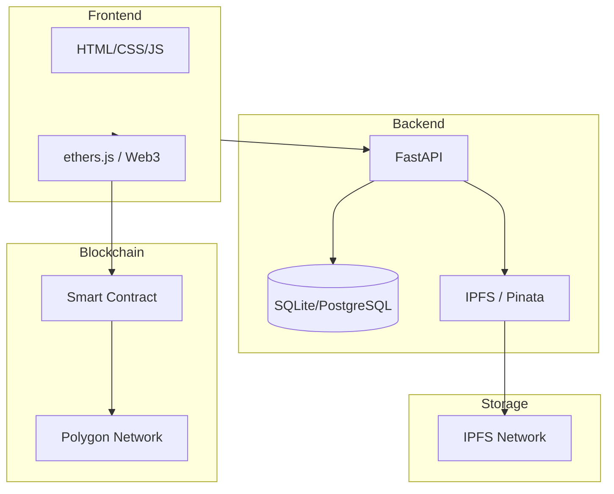

# IP-Chain (知识产权链)

> 把你的创意、艺术、知识保护在区块链上，自由交易

IP-Chain 是一个基于区块链的知识产权保护与交易平台。任何人都可以上传自己的作品（艺术、音乐、代码、文章、知识等），生成数字指纹并铸造为 NFT，在去中心化市场上自由交易。

## 功能

### 核心功能

- **知识产权注册** — 上传作品，自动生成 SHA-256 数字指纹，存证到区块链
- **NFT 铸造** — 将知识产权铸造为 ERC-721 NFT，所有权不可篡改
- **去中心化存储** — 文件存储到 IPFS，内容永久保存
- **交易市场** — 挂单出售、竞价购买，交易记录上链
- **钱包连接** — 支持 MetaMask 等 Web3 钱包

### 建议扩展功能

| 功能 | 说明 |
|---|---|
| **版权授权** | 支持按时间/用途授权（非买断），自动到期 |
| **版税分成** | 每次转售自动分配版税给原作者（ERC-2981） |
| **批量注册** | 一次上传多个作品，批量铸造 |
| **作品验真** | 输入文件哈希即可验证是否已在链上注册 |
| **社交图谱** | 关注创作者、作品合集、评论互动 |
| **AI 生成检测** | 集成 AI 内容检测，标记 AI 生成作品 |
| **链上仲裁** | 争议作品通过 DAO 投票仲裁 |
| **法币入口** | 集成 Stripe 等支付，用户无需持有加密货币 |
| **移动端 APP** | React Native 或 Flutter 移动应用 |

## 技术架构



### 技术栈

| 层面 | 技术 |
|---|---|
| 前端 | HTML5 / CSS3 / JavaScript (Vanilla) |
| 后端 | Python FastAPI |
| 数据库 | SQLite（开发）/ PostgreSQL（生产） |
| 智能合约 | Solidity + Hardhat |
| 区块链 | Polygon (Ethereum L2) |
| 存储 | IPFS (via Pinata) |
| 部署 | Docker + Nginx (美国服务器) |

## 项目结构

```
ip-chain/
├── contracts/                 # Solidity 智能合约
│   ├── IPRegistry.sol         # IP 注册 + NFT + 市场合约
│   ├── hardhat.config.js      # Hardhat 部署配置
│   ├── scripts/deploy.js      # 部署脚本
│   └── package.json
├── backend/                   # Python FastAPI 后端
│   ├── main.py                # 应用入口
│   ├── models.py              # 数据库模型
│   ├── database.py            # 数据库配置
│   ├── requirements.txt       # Python 依赖
│   ├── routes/
│   │   ├── auth.py            # 钱包认证
│   │   ├── ip_assets.py       # IP 资产管理
│   │   └── marketplace.py     # 市场交易
│   └── blockchain/
│       ├── ipfs.py            # IPFS 集成
│       └── web3_helper.py     # Web3 工具
├── frontend/                  # 前端页面
│   ├── index.html             # 首页
│   ├── css/style.css          # 样式
│   ├── js/
│   │   ├── app.js             # 主应用逻辑
│   │   ├── api.js             # API 客户端
│   │   └── blockchain.js      # 区块链交互
│   └── pages/
│       ├── dashboard.html     # 用户面板
│       ├── marketplace.html   # 交易市场
│       └── upload.html        # 作品上传
├── Dockerfile                 # Docker 构建
├── docker-compose.yml         # Docker Compose
├── deploy.sh                  # 一键部署脚本
└── .env.example               # 环境变量模板
```

## 快速开始（本地开发）

### 1. 安装依赖

```bash
# Python 后端
cd backend
pip install -r requirements.txt

# 智能合约
cd contracts
npm install
```

### 2. 配置环境变量

```bash
cp .env.example .env
# 编辑 .env，填入你的配置
```

必填配置：
- `PINATA_API_KEY` / `PINATA_SECRET_KEY` — 在 https://pinata.cloud 注册获取
- `JWT_SECRET` — 随机字符串

### 3. 启动后端

```bash
cd backend
uvicorn main:app --reload --host 127.0.0.1 --port 8000
```

### 4. 打开前端

直接用浏览器打开 `frontend/index.html`，或启动任意静态服务器：

```bash
python -m http.server 8080 --directory frontend
```

## 部署智能合约

### 测试网部署 (Polygon Mumbai)

```bash
cd contracts
export PRIVATE_KEY=你的钱包私钥
export RPC_URL=https://rpc-mumbai.maticvigil.com
npx hardhat run scripts/deploy.js --network polygon_mumbai
```

### 主网部署 (Polygon)

```bash
cd contracts
export PRIVATE_KEY=你的钱包私钥
export RPC_URL=https://polygon-rpc.com
npx hardhat run scripts/deploy.js --network polygon
```

部署成功后，将合约地址填入 backend/.env 的 `CONTRACT_ADDRESS`。

## 部署到美国服务器

### 一键部署

```bash
# 上传项目到服务器后
chmod +x deploy.sh
./deploy.sh
```

### 手动部署

```bash
# 1. 安装 Docker
sudo apt install docker.io docker-compose

# 2. 配置环境变量
cp .env.example .env
nano .env  # 填入 API Key 等配置

# 3. 用 Docker 启动
docker-compose up -d
```

### Nginx + HTTPS

```nginx
server {
    listen 80;
    server_name your-domain.com;
    
    location / {
        proxy_pass http://127.0.0.1:8000;
        proxy_set_header Host $host;
        proxy_set_header X-Real-IP $remote_addr;
        proxy_set_header X-Forwarded-For $proxy_add_x_forwarded_for;
        proxy_set_header X-Forwarded-Proto $scheme;
        proxy_read_timeout 300s;
        client_max_body_size 100m;
    }
    
    location /uploads/ {
        alias /path/to/uploads/;
        expires 30d;
    }
}
```

```bash
sudo apt install nginx certbot python3-certbot-nginx
sudo certbot --nginx -d your-domain.com
```

## API 接口

### 认证

| 方法 | 路径 | 说明 |
|---|---|---|
| POST | /api/auth/nonce | 获取钱包签名随机数 |
| POST | /api/auth/verify | 验证钱包签名，返回 JWT |

### IP 资产

| 方法 | 路径 | 说明 |
|---|---|---|
| POST | /api/ip/upload | 上传作品 |
| GET | /api/ip/{id} | 获取作品详情 |
| GET | /api/ip/my | 获取我的作品列表 |
| POST | /api/ip/mint | 记录区块链铸造 |

### 市场

| 方法 | 路径 | 说明 |
|---|---|---|
| GET | /api/market/listings | 获取所有在售作品 |
| POST | /api/market/list | 挂单出售 |
| POST | /api/market/buy | 购买作品 |
| GET | /api/market/transactions | 交易记录 |

## 购买域名和服务器建议

### 域名
- 推荐：**Namecheap** 或 **GoDaddy**
- 后缀建议：`.io` `.app` `.art` 或 `.com`
- 例：`ipchain.io` `creativemarket.app` `ideaprotect.art`

### 美国服务器
| 服务商 | 配置推荐 | 月费 |
|---|---|---|
| **DigitalOcean** | 4GB RAM / 2CPU / 80GB SSD | ~$24 |
| **Vultr** | 4GB RAM / 2CPU / 80GB NVMe | ~$24 |
| **Linode** | 4GB RAM / 2CPU / 80GB SSD | ~$24 |

### 费用估算

| 项目 | 月费用 |
|---|---|
| 服务器 | $24 - $40 |
| 域名 | ~$12/年 |
| Pinata IPFS | $20 (1GB存储, 10万请求) |
| Polygon RPC | 免费 ~ $20 |
| 合约部署 | ~$50-$200 一次性 (Polygon Mainnet) |

## License

MIT